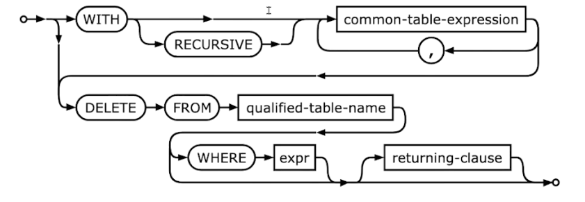
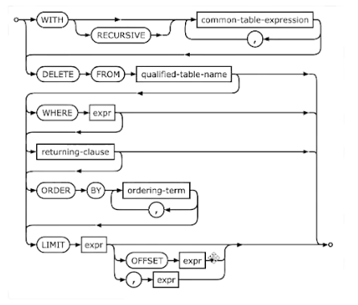
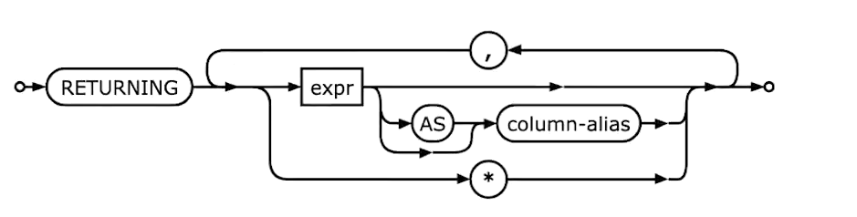

# 第四章作业_DELETE语句

## 作业

在整个增删改查的 SQL 语句里面，如果按照复杂度来算的话应该是 `SELECT > INSERT > UPDATE > DELETE`。

`DELETE` 因为语法本身就很简单，所以很适合作为我们练习使用 `Builder` 来构造 SQL。那么这一次作业就是在我们 V2 基础上支持一下 `DELETE` 语句。

你需要实现 `Deleter` 并且通过所有的测试用例。本次作业较为简单，预估时间在两个小时左右。


## 需求分析

### 场景分析

`DELETE` 语句的使用场景大体上来说非常简单：

+ 执行删除语句，会删除部分数据。一般来说就是带了 ` WHERE` 条件的 `DELETE` 语句。
+ 删除全部数据，例如 `` DELETE FROM `user` ``。有些时候用户会期望 ORM 框架禁用这种语句，因为这种语句会特别危险。不过站在 ORM 的立场上，我们并不需要禁止这一类查询，而是交给用户他们自己去控制（他们可以在后续课程的 AOP 里面找到解决方案）。
+ 使用带 `LIMIT` 和 `OFFSET` 的删除语句。在部分方言里面，是支持在 `DELETE` 里面带上 `LIMIT` 或者 `OFFSET` 部分的。例如 `DELETE FROM user WHERE id > 0 LIMIT 10 OFFSET 100`。但是实际上，这种用法很罕见。因为一般使用 `DELETE` 语句都是将符合条件的全部删除。
+ 使用 `returning-clause`。即返回删除的数据。例如典型的场景是我们希望获得被删除的数据的主键，那么就可以考虑执行类似 ``DELETE FROM `user` RETURNING `id` ``。（MYSQL 是不支持这一特性）
+ 在 `FROM` 中使用子查询。这个语法特性更加罕见，例如说 `DELETE FROM (SELECT xxx)`，可以完全不考虑支持。

### 功能需求

支持 `DELETE` 语句：

+ 支持 `WHERE` 筛选条件

不必支持：

+ `LIMIT` 和 `OFFSET`。
+ `RETURNING`。
+ 子查询。

<u>这三个特性在 `DELETE` 的场景下都很少使用。</u>


## 行业方案

### 方言

#### MySQL

MySQL 的 `DELETE` 语法非常简单：

```sql
DELETE [LOW_PRIORITY] [QUICK] [IGNORE] FROM tal_name [[AS]tab_alias]
	[PARTITION (partition_name [, partition_name] ...)]
	[WHERE where_condition]
	[ORDER BY ...]
	[LIMIT row_count]
```

一个显著的特征是 MySQL 支持 `LIMIT` 和 `ORDER BY`。但是和 `SELECT` 不一样的是，MySQL 在 `DELETE` 里面的 `LIMIT` 特性不支持指定偏移量（`OFFSET`）。

#### SQLite

默认情况下，SQLite 的语法：



可以看到，和 MySQL 比起来，它不支持 `LIMIT`，也不支持 `ORDER BY`，但是支持一个 `returning clause`。

但是如果 SQLite 编译的时候开启了 `DELETE LIMIT`，那么它的语法形态就是：



可以看到，它不仅仅支持 `LIMIT` 和 `ORDER BY`，还支持了 `OFFSET`。

那么从 ORM 的角度来看，应该考虑支持 `LIMIT`  和 `ORDER BY`。毕竟我们并不能要求用户不启用这个特性。

而 `returning-clause` 的特性则是返回被删除的数据（或者部分列）。



```sql
delete from myTable returning *
```

```sql
delete from myTable returning `id`
```

这个特性在某些时候会很有用，例如我们希望获得被删除的数据的 `ID`。在缺乏 `returning-clause` 功能特性的情况下，我们只能考虑开启事务，而后执行 `select` 查询，再执行 `delete` 语句。

#### PostgreSQL

PostgreSQL 的语法：

```sql
[WITH | [ RECURSIVE ] with_query [, ...] ]
DELETE FROM [ ONLY ] table_name [ * ] [ AS ] alias ]
	[ USING from_item [, ...] ]
	[ WHERE condition | WHERE CURRENT OF cursor_name ]
	[ RETURNING * | output_expression [ [ AS ] output_name ] [, ...] ] 
```

可以注意到:

+ Post greSQL 不支持 `LIMIT` 和 `OFFSET` 这两个选项。
+ PostgreSQL 支持 `RETURNING` 选项。

除此以外，PostgreSQL 还有两个有趣的特性：

+ `Using`：接近 `JOIN` 的用法，可以通过在 ` FROM` 中使用子查询来避免使用 `USING`。
+ `WHERE CURRENT OF`：这是利用游标来删除数据，不过现实中游标是不建议使用的，所以也很少用。


## 设计

很显然，延续我们已有的 `Builder` 模式：

```go
type Deleter[T any] struct {}

func (d *Deleter[T]) From(table string) *Deleter[T]{}

func (d *Deleter[T]) Where(ps ...Predicate) *Deleter[T]{}	

func (d *Deleter[T]) Build() (*Query, error){}
```

这里有一个问题，即在 `Deleter` 上使用泛型的收益是不如 `Selecter` 和 `Inserter` 的。`Selector` 可以用泛型来约束返回值，而 `Inserter` 可以用泛型来约束插入的数据类型。

不过我们这里依旧坚持使用泛型，是为了和其它语句的设计保持一致。


## 例子

```go
(&Deleter[TestModel]{}).Build()
// DELETE FROM `TestModel`;

(&Deleter[TestModel]{}).From("`test_model`").Build()
// DELETE FROM `test_model`;

(&Deleter[TestModel]{}).Where(C("Id").Eq("12"))
// DELETE FROM `TestModel` WHERE `Id` = ?
// args: []any{12}
```


## 测试

### 单元测试

单元测试需要考虑：

+ 是否使用 `From` 来指定表名。
+ 是否使用 `Where`，以及在使用 `Where` 的时候使用了 `And`，`Or`，`Not`。

### 集成测试

在我们尚未接触到结果处理之前，这个可以忽略。 

